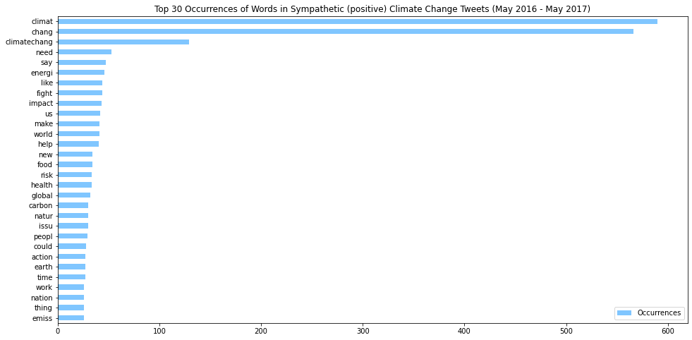

<style type="text/css">
    img[alt="sbs_compare"] {
        width: 49%;
    }
</style>

# Climate-Change-Sentiment-Predictor

This project aims to develop a program that, given a tweet relating to climate change, can predict whether the user's sentiment is sympathetic regarding climate change or not. Using data from a dataset of tweets with a manually labeled sentiment to train from, we aim to help future analysis regarding climate change through this program that looks into human sentiments through tweets. By providing a program that automatically labels sentiments, this project can easily provide future research with numerous and timely data to use.

<!--

This project is developed by:
- Alvarado, Enrique Luis (Aikiro42)
- Bassig, Lance Raphael (LRB)
- Roxas, Dennis Christian (Densho)
- Surara, Ron Christian (inazumaron)

-->


## Problem Statement

This project aims to lay the groundwork towards answering the following question: "How sympathetic can we expect the general populace to be with regards to climate change?"

In particular, the research group seeks to do the following:
1. Perform Exploratory Data Analysis (EDA) on the composition and word occurences of the data set from which the machine will learn from,
2. Choose the best Logistic Regression model to use,
3. Utilize the learned machine to label climate change related tweets from May 2016 to May 2017, and from May 2021 to May 2022.
4. Perform EDA on the composition and word occurences of the resulting labeled data, and
5. Determine if there is a significant change in sentiment on climate change over the past half decade.

The null hypothesis is determined to be that "there is no significant change in the twitter sentiment on climate change from 2016-2017 and that of 2021-2022."

The alternative hypothesis is determined to be that "there is a significant change in the twitter sentiment on climate change from 2016-2017 and that of 2021-2022."

<!--
In order to make the first steps towards fully answering the main question, we first need a way to review the data needed to construct a satisfying answer. As of May 2022, 500,000,000 tweets are posted every day (Internet Live Stats, 2022), and even if less that 1 percent of that is related to climate change, a small group of humans will take a while reviewing hundreds of thousands of data, so we need to have a machine that assists us in our endeavor.
-->

## Definition of Terms

1. **Sympathetic**: _Adjective describing someone who talks and acts for a particular topic/sentiment: in this study, someone or something who is aware of, or expresses awareness of, and/or acts in a way that makes others be positively aware of, climate change._
2. **"Positive"**: _Label of climate change tweets that attempt to bring positive awareness to climate change and their causes through information or persuation. In essence, this label is attached to tweets aligned with the sentiment that humans are the cause of climate change and that it is an urgent issue. This label also includes news on climate change._
    <!-- Indiscriminately bang nilabel ang true and fake news under this label? -->
3. **"Negative"**: _Label of climate change tweets that negatively bring awareness to climate change and their causes, e.g. deniers of climate change or stating that the issue is out of our control thus dissuading action._
    <!-- Ininclude ba ang fake news sa label na ito? -->
4. **"Neutral"**: _Label of climate change tweets that simply express awareness of the issue but not attempt to inform, persuade nor dissuade people from it are labeled "neutral"._


## Methodology

The machine that we have developd was be made to learn how to classify climate-change related tweets to the following categories: "positive", "negative", and "neutral". (See the definition of terms for what each of the labels mean)

Each tweet in the learning data that was used by the machine was individually labeled by the research group according to their stance and sentiment on climate change; the [Climate Sentiment on Twitter](https://www.kaggle.com/datasets/joseguzman/climate-sentiment-in-twitter?resource=download) (Guzman, 2020) dataset was reviewed for this purpose. This dataset is a raw database of 396 tweets from January 2020 to December 2020. The data from this dataset is just large and recent enough to be utilized for this project.

The data was preprocessed by adding a new `Sympathy?` column that indicates whether a tweet is sympathetic to climate change or not; then the group manually added the appropriate value for each tweet ("Yes" if the tweet is sympathetic to climate change, "No" otherwise). Instances of null rows were removed, and `TfidfVectorizer` was then used to convert text data to numeric data. The tweet content will be cleaned of its URLs, hashtags, mentions, emojis, smileys, and stop words (e.g. "a", "the", "this" , "amp", which is the HTML code of the ampersand symbol, `&amp`); this is so that the machine can better process and properly learn the necessary information from the dataset. Exploratory data analyses on the sentiment composition and word occurences were also performed on this dataset to have an idea of what the machine learns from the tweets.

The Logistic Regression model, particularly the Limited-Memory Broyden–Fletcher–Goldfarb–Shanno (LBFGS) solver, will be used in this project. According to a prior analysis (Kim, 2022) on a similar dataset (Qian, 2019), this model has been observed to perform best particularly in distinguishing tweets on climate change to appropriate sentiment labels.

After the machine has been developed, tweets related to climate change was scalped from twitter and fed to the machine. Because of the location of the research group, the demographic of the scalped data is mostly located in the Philippines. The resulting labeled data was then explored in order to answer the main problem faced by this project.

Specifically, 1059 tweets related to climate change between May 2016 to May 2017 and 1002 tweets related to climate change between May 2021 to May 2022 were then scalped from twitter for the machine to label. Exploratory data analysis is performed on the resulting labeled data to have an idea on what the sentiments of the tweets are like.

Finally, a chi-squared test is performed on the sentiment counts of the results of the two datasets labeled by the machine to determine whether to reject the null hypothesis or not, with `alpha = 1 - model accuracy`.

## Results and Discussion

### Exploration of Training Dataset

The composition of the dataset used to train the machine can be observed in the following graph:


_Figure 1. Sentiment Composition of the dataset used to train the machine._

Almost half of the training dataset is composed of positive tweets, while the remaining half is composed of a roughly equal number of neutral and negative tweets, with negative tweets having the least number in the dataset.

When the dataset was cleaned and tokenized, the word occurrences and compositions of tweets of respective sentiments can then be determined.

The following bar graphs show the occurrences of the top 30 most occuring words among tweets of the respective sentiment:


_Figure 2. Bar graph of word occurrences in the positive tweets of the dataset used to train the machine._

The words shown seem incomplete because they are determined by the tokenizer to be the root word, e.g. "chang" can mean "changing", "change", "changes", etc.


_Figure 3. Bar graph of word occurrences in the neutral tweets of the dataset used to train the machine._


_Figure 4. Bar graph of word occurrences in the negative tweets of the dataset used to train the machine._

Accross all sentiments, the most occurring words are "climat", "chang" and "global"; this can be attributed to the reason that the data was scalped from search results made with these keywords.

In order to get a better idea of the general sentiment we can expect from the labeled dataset, we take a look at the occurrences and wordclouds of the most occurring words, excluding the three most occurring words, "climat", "chang", and "global". The wordclouds are constructed based on the data the bar graphs use, so the reduced bar graphs and wordclouds will be shown consecutively.


_Figure 5. The same bar graph as Figure 2, but excluding the top three words._ 


_Figure 6. Wordcloud of the positive tweets of the training dataset._

The wordcloud of positive tweets shows that words associated with climate change sympathy are that of urgency, science, time, and  recognition of the issue as a negative one. Figure 6 thus implies that sympathetic tweets talk about the urgency of solving the issue of climate change.

Notable words that appear in the wordcloud are "reduc[e]" and "emiss[ions]", "caus[e]", "couldfight", and "human". These words imply that climate change sympathetic tweets show optimism and recognition of the cause of climate change, as well as suggest possible solutions for the issue.


_Figure 7. The same bar graph as Figure 3, but excluding the top three words._ 


_Figure 8. Wordcloud of the neutral tweets of the training dataset._

The wordcloud of neutral tweets shows that words associated with climate change neutrality are associated with concern for other global events and common causes of global warming (particularly fossil fuels). This implies that the neutral climate change sentiment is associated with general awareness of the issue.

Notable words that appear in the wordcloud are "thunberg", "local", "coronavirus" and "new". Greta Thunberg is a Swedish climate change activist that grew in popularity due to her initiative and age. (BBC, 2019) The dataset is composed of tweets from 2020, which was the time when the Coronavirus pandemic struck the world.


_Figure 9. The same bar graph as Figure 4, but excluding the top three words._ 


_Figure 10. Wordcloud of the negative tweets of the training dataset._

The wordcloud of apathetic tweets shows that words associated with climate change apathy are associated with concerns regarding the truth of climate change and its causes. This implies that tweets apathetic to climate change express belief in the facts that proves climate change is the cause of natural occurrences.

Notable words include "milankovich", "boomer", "hoax", "old", "season", and "cycle". The Milankovich cycle relates the effects of the earth's position, rotate and orientation with the changes in climate. "Boomer" is a term used to refer to the Baby Boomer generation, born during the post-WWII baby boom, and are often prone to misinformation from fake news. (Brashier & Schacter, 2020) This implies that climate change-apathetic tweets express, or are possibly caused by, misinformation.

### Model Accuracy Results

The following tables shows the accurracy scores of various models trained with our datasets:

|Logistic Regression Model|Best Accuracy Score|
|-------------------------|-------------------|
|`newton-cg`              |0.7122302158273381 |
|`lbgfs`                  |0.7338129496402878 |
|`liblinear`              |0.7194244604316546 |

_Table 1. Accuracy Scores of three different logistic regression models._

|Support Vector Machine Model|Best Accuracy Score|
|----------------------------|-------------------|
|Linear Kernel               |0.697841726618705
|Polynomial Kernel           |0.7050359712230215 
|RBF Kernel                  |0.7050359712230215
|Sigmoid                     |0.5899280575539568

_Table 2. Accuracy Scores of various Support Vector Machine Models._

The Naive-Bayes model had an accuracy score of 0.60431654676259. Hence, the best model to use for this project is the Limited-memory Broyden–Fletcher–Goldfarb–Shanno (`lbfgs`) solver of Logistic Regresstion, with an accuracy of 73.38%.

Thus, the LBGFS model will be used to label the sentiments of the tweets in the 2016-2017 and 2021-2022 Climate Change datasets, which were scalped by the research group. It must be noted that the datasets come from the Philippine demographic.

### Exploration of the Labeled Dataset from 2016-2017

The composition of the 2016-2017 dataset labeled by the machine can be seen in the following figure:


_Figure 11. Composition of the 2016-2017 labeled Climate Change Sentiment Dataset._

The following three graphs show that, much like the test dataset, there are common words that occur the most frequently as a by-product of the scalping procedure:



_Figure 12. Most frequently occuring words in the climate change-sympathetic tweets of the 2016-2017 dataset._


_Figure 13. Most frequently occuring words in the climate change-neutral tweets of the 2016-2017 dataset._


_Figure 14. Most frequently occuring words in the climate change-apathetic tweets of the 2016-2017 dataset._

Accross all sentiments, the most occurring words are "climat" and "chang". Again, in order to get a better idea of the general sentiment we can expect from the labeled dataset, we take a look at the occurrences and wordclouds of the most occurring words, excluding the two most occurring words:


_Figure 15. The same graph as that of Figure 12, but excluding the top two words._


_Figure 16. Wordcloud of climate change-sympathetic tweets in the labeled 2016-2017 dataset._

The most prominent words in the wordcloud imply that synpathetic tweets are concerned with general things associated with climate change, particularly sustainability, food, health, and energy. Notable words in the datacloud are "gun", "fund", "commun" and "think".


_Figure 17. The same graph as that of Figure 13, but excluding the top two words._


_Figure 18. Wordcloud of climate change-neutral tweets in the labeled 2016-2017 dataset._

Looking into the actual tweets from which the words originate, it is apparent that the prominent words in the wordcloud of climate change neutral tweets come from things that are indirectly or directly affected by climate change, or are indirectly or directly causing climate change. For example, the presence of "2022" among the occurring words comes from tweets that talk about the future of business while taking climate change into account.


_Figure 19. The same graph as that of Figure 14, but excluding the top two words._


_Figure 20. Wordcloud of climate change-neutral tweets in the labeled 2016-2017 dataset._

The wordcloud of climate change-apathetic tweets suggest that such tweets are of selfish nature, concerned with self-benefit. Notable words in this wordcloud include "republican", "crypto", "lie", "hoax", and "kill". The high occurrence of "people" and "Want" is also of interest.

### Exploration of the Labeled Dataset from 2021-2022

The composition of the 2016-2017 dataset labeled by the machine can be seen in Figure 21:


_Figure 21. Composition of the 2016-2017 labeled Climate Change Sentiment Dataset._

From here we can see that the 2021-2022 dataset has more sympathetic tweets than the 2016-2017, suggesting a positive trend in climate change sentiment.

Like the previous two datasets discussed, there are words that occur frequently accross all sentiments:


_Figure 22. Most frequently occuring words in the climate change-sympathetic tweets of the 2021-2022 dataset._


_Figure 23. Most frequently occuring words in the climate change-neutral tweets of the 2021-2022 dataset._


_Figure 24. Most frequently occuring words in the climate change-negative tweets of the 2021-2022 dataset._

We will now discuss the word occurrences and wordclouds of each sentiment excluding the common and most frequent words.


_Figure 25. The same graph as that of Figure 22, but excluding the top two words._


_Figure 26. Side-by-side comparison of the wordclouds of 2016-2017 and 2021-2022 sympathetic tweets. The right wordcloud is the 2021-2022 wordcloud._


The climate change-sympathetic tweets from 2021-2022 have similarly occuring words with the climate change-sympathetic tweets from 2016-2017. Notably, certain words are more prominent in the wordcloud: "impact", "energi", "help", "need" and "fight" are some of them. This suggests that later tweets of this nature indicate an increased urgency towards solving the issue of climate change.


_Figure 27. The same graph as that of Figure 23, but excluding the top two words._


_Figure 28. Side-by-side comparison of the wordclouds of 2016-2017 and 2021-2022 neutral tweets. The right wordcloud is the 2021-2022 wordcloud._

The neutral tweets from the 2021-2022 dataset notably has more prominent climate-change related words than those from the 2016-2017 dataset. Notable words that are present in the 2021-2022 wordcloud are "vote" and "peopl[e]". This implies that the tweets express recognition of the leaders being able to affect efforts toward solving climate change.

### Chi-squared Test Results

To determine if there is a significant change in climate change sentiment over the past half-decade, the chi-squared test was utilized, with alpha equal to approximately 0.2662 (`alpha = 1 - model accuracy`). With a p-value of 0.012732, the null hypothesis is rejected. Therefore, it is concluded that there is a significant change in climate change sentiment over the past half-decade.


## Conclusion

This study has determined that, in the past half decade, there has been a significant positive change in sentiment on Climate Change.

The training data used for this project was too small to be truly certain of the change in climate change sentiment. It is recommended that, in future replications of this project, the data is larger than just 400 tweets, and that the data has equal distributions among the positive, neutral, and negative tweets.

## References

(2022) Twitter Usage Statistics. _Internet Live Stats._ Archived 2022, May 7, 5:55 PM GMT: https://web.archive.org/web/20220507054131/https://www.internetlivestats.com/twitter-statistics/

Guzman, J. (2020). 2020 Climate Sentiment on Twitter. Kaggle. Retrieved from https://www.kaggle.com/datasets/joseguzman/climate-sentiment-in-twitter?resource=download

Qian, E. (2019, November 13). Twitter Climate Change Sentiment Dataset. Kaggle. Retrieved from https://www.kaggle.com/datasets/edqian/twitter-climate-change-sentiment-dataset

Kim, R. (2022, April 5). Twitter Climate Change Analysis. Kaggle. Retrieved from https://www.kaggle.com/code/roellekim/twitter-climate-change-sentiment-analysis

BBC. (2019, April 23). Climate change activist Greta Thunberg: 'Listen to climate scientists' (Video). _BBC News._ Retrieved from https://www.bbc.com/news/av/uk-48018034

Brashier, N. M. & Schacter, D. L. (2020, May 19). Aging in an Era of Fake News
. _Current Directions in Psychological Science, 29(3)._ doi:10.1177/0963721420915872

## Appendix

<!--

## Unreviewed

Patronella, A. M. (2021). Covering Climate Change: A Sentiment Analysis of Major Newspaper Articles from 2010 - 2020. _Inquiries Journal, 13(9)_. Archived 2022, May 11, 11:43 AM GMT: https://web.archive.org/web/20220511114350/http://www.inquiriesjournal.com/articles/1910/covering-climate-change-a-sentiment-analysis-of-major-newspaper-articles-from-2010--2020

-->

### I. Libraries Used

```python
import numpy as np
import pandas as pd
import matplotlib.pyplot as plt
import seaborn as sns
import math
import copy
import wordcloud

import nltk.downloader
from nltk.tokenize import RegexpTokenizer
from nltk.corpus import stopwords
from nltk.stem import PorterStemmer

from sklearn.preprocessing import LabelEncoder
from sklearn.feature_extraction.text import TfidfVectorizer
from sklearn.feature_extraction.text import CountVectorizer

df = pd.read_csv('Climate_Sentiments_Twitter.csv')
# df.head()
```

### II. Utility Functions and Constant Declarations
```python
C_TEST_POSITIVE = '#bde69c'
C_TEST_NEUTRAL = '#fce26a'
C_TEST_NEGATIVE = '#ff8080'

C_TEST_POSITIVE_H = 93
C_TEST_NEUTRAL_H = 49
C_TEST_NEGATIVE_H = 1

C_POSITIVE = '#80c6ff'
C_NEUTRAL = '#bba9e8'
C_NEGATIVE = '#ff8080'

C_POSITIVE_H = 207
C_NEUTRAL_H = 257
C_NEGATIVE_H = 1

DISABLE_BARGRAPHS = False
DISABLE_WORDCLOUDS = False

# 1
# 7
# 96
# 134
# 188
# 198
# 360

# FUNCTION DECLARATIONS

# Horizontal Bar Plot Generator from Dictionary
def gen_barhplot(srcdict, vals_label="0",fig_title="", bar_color="", cutoff=0, top_index=30):
    if not DISABLE_BARGRAPHS:
        srcdf_labels = list(srcdict.keys())
        srcdf_data = list(srcdict.values())
        srcdf = pd.DataFrame(data=srcdf_data, index=srcdf_labels, columns=[vals_label])

        srcdf.sort_values([vals_label], ascending=[True], inplace=True)
        srcdf_trim = srcdf[-1 * (top_index):]
        if cutoff > 0:
            srcdf_trim = srcdf_trim[:-cutoff]
        ax = srcdf_trim.plot(title=fig_title, figsize=(16, 8), kind="barh", color=("Blue" if bar_color == "" else bar_color))

# Wordcloud Generator from Dictionary
def gen_wordcloud(source_dict, common_highf_words=[], hue=-1,word_num_limit=200,gradient_step=3,fig_title=""):
    
    if not DISABLE_WORDCLOUDS:

        # generate wordcloud from frequency dictionary

        temp_freq_storage = {}

        # set frequency common highest-frequency words to 0
        for word in common_highf_words:
            try:
                temp_freq_storage[word] = source_dict[word]
                source_dict[word] = 0
            except KeyError:
                pass

        max_stat = max(list(source_dict.values()))
        # print(f"Most occurrences of word: %d" % max_stat)

        def custom_color_func(word, font_size, position, orientation, random_state=None,**kwargs):
            # print(f"%s: %f" % (word, (100*source_dict[word])/max_stat))
            saturation_val = min((gradient_step * 100 * source_dict[word]) // max_stat, 100)
            lightness_val = min((gradient_step * 100 * source_dict[word]) // (2 * max_stat), 50)
            return "hsl(%d, %d%%, %d%%)" % (abs(hue), (0 if hue < 0 else 1) * saturation_val, lightness_val)


        # generate wordcloud
        gen_wordcloud_fig = wordcloud.WordCloud(width=1600, height=1600,
                                mode="RGBA",
                                background_color=None,
                                max_words=word_num_limit,
                                min_font_size=1).generate_from_frequencies(frequencies=source_dict)

        # restore word frequencies
        for word in common_highf_words:
            try:
                source_dict[word] = temp_freq_storage[word]
            except KeyError:
                pass

        plt.figure(figsize = (8, 8), facecolor = None)
        plt.title(fig_title)
        plt.imshow(gen_wordcloud_fig.recolor(color_func=custom_color_func, random_state=0), interpolation="bilinear")
        plt.axis("off")
        plt.tight_layout(pad = 0)
        plt.show()

nltk.download('stopwords')
```

### III. Data Preprocessing

```python
#Transforming the sympathy? column to sympathy
df.rename(columns={"sympathy?":"sympathy"}, inplace=True)
```

### IV. Data Cleaning
```python
#Dropping unneeded columns
df = df[['text', 'sympathy']]
df = df.sample(frac=1, random_state=7).reset_index(drop=True)
# df.head()
```

### V. Data Encoding
```python
#Transforming the sympathy column to numerical values using the replacement method
params = {"negative": -1, "neutral": 0, "positive": 1}
df['sympathy'].replace(params, inplace=True)
df.head()
```

### VI. Data Representation
```python
#Creating the feature(s) and target vectors
features = df.drop("sympathy", axis=1)
target = df["sympathy"]

# features.head()
```

### VII. Text Data Tokenization
```python
#Tokenize the text data using RegexpTokenizer
textdata = features['text']
n = len(textdata)
tokenizer = RegexpTokenizer(r'\w+')
tokenizedtext = []

for i in range(n):
    #Convert text data to lowercase
    lower = textdata.iloc[i].lower()
    
    #Tokenize
    wordsarray = tokenizer.tokenize(lower)
    tokenizedtext.append(wordsarray)

#print(tokenizedText)
```

### VIII. Text Data Cleaning
```python
#Removing stop words using nlkt
englishstopwords = set(stopwords.words('english'))
englishstopwords.add("amp")
shortertext = []

for tweet in tokenizedtext:
    shortertweet = []
    for word in tweet:
        if word not in englishstopwords:
            word = word.strip()
            if (word.isdigit() == False and len(word) >= 2):
                shortertweet.append(word)
    shortertext.append(shortertweet)

#print(shorterText)

#Stemming using PorterStemmer
porterstemmer = PorterStemmer()
stemmedtext = []
for tweet in shortertext:
    stemmedwords = []
    for word in tweet:
        stemmedwords.append(porterstemmer.stem(word))
    convertback = ' '.join(stemmedwords)
    stemmedtext.append(convertback)

#Create a separate dataframe dfcv for later EDA
dfcv = df.copy()
dfcv['text'] = stemmedtext

# dfcv.head()
```

### IX. Text Data Vectorization
```python
#Vectorizing the text data using TFIDvectorizer for Modelling
tfid = TfidfVectorizer()
vectorizedtfid = tfid.fit_transform(stemmedtext)

#print(vectorizedtfid)
#print(tfid.vocabulary_)
```

### X. Preparation of Data for Explorations
```python
senti_dict = [{}, {}, {}]

for i in range(dfcv.shape[0]):
    wordarray = dfcv['text'].iloc[i].split(" ")
    sentiment = dfcv['sympathy'].iloc[i]
    for word in wordarray:
        try:
            senti_dict[sentiment][word] += 1
        except KeyError:
            senti_dict[sentiment][word] = 1

for i in range(3):
    senti_dict[i] = dict(sorted(senti_dict[i].items(), key=lambda item: item[1], reverse=True))

prodict = senti_dict[1]
neutraldict = senti_dict[0]
antidict = senti_dict[-1]
```

### XI. Distribution of Sentiments (Example)
```python
plt.figure(figsize = (8, 8))
values = df['sympathy'].value_counts().values
labels = ['positive', 'neutral', 'negative']
plt.pie(
    values,
    labels=labels,
    textprops={'fontsize': 15},
    autopct="%.2f%%",
    colors=[C_TEST_POSITIVE,C_TEST_NEUTRAL,C_TEST_NEGATIVE]
)
plt.title('Sentiment Distribution of the 2020 Twitter Training+Testing Dataset', fontsize=20)
plt.show()
```
### XII. Bar Graphs of Word Occurrences and Wordcloud (Example)
```python
gen_barhplot(
    prodict,
    "Occurrences",
    "Top 30 Occurrences of Words in Sympathetic (positive) Climate Change Tweets (Training+Test Data)",
    C_TEST_POSITIVE,
    cutoff=0
)
gen_barhplot(
    prodict,
    "Occurrences",
    "Top 30 Occurrences of Words in Sympathetic (positive) Climate Change Tweets (Training+Test Data), top 3 excluded",
    C_TEST_POSITIVE,
    cutoff=3)
gen_wordcloud(
    prodict,
    ["climat", "chang", "global"], 
    hue=C_TEST_POSITIVE_H,
    fig_title="Sympathetic Climate Change Tweet Datacloud (Training+Test Data), top 3 most occuring words excluded", gradient_step=4.65
)
```

### XIII. Determining model to use
```python
#
# Use "vectorizedtfid" for the features matrix
# and "target" dataframe for the target vector
#

from sklearn.model_selection import train_test_split
x_train, x_test, y_train, y_test = train_test_split(vectorizedtfid, target, test_size=0.30, shuffle=True, random_state=0)

from sklearn.linear_model import LogisticRegression
alpha_complement = 0
for s in ['newton-cg','lbfgs','liblinear']:
    print ("Solver: ", s)
    logisticRegr = LogisticRegression(C=1000000,solver=s,max_iter=1000000)
    logisticRegr.fit(x_train,y_train)
    score = logisticRegr.score(x_test,y_test)
    if s == 'lbfgs':
        alpha_complement = score
    print("Accuracy Score:", score)

from sklearn.model_selection import train_test_split
x_train, x_test, y_train, y_test = train_test_split(vectorizedtfid, target, test_size=0.30, random_state=0)

from sklearn import svm

#Linear
print("Linear Kernel:")
SVMclassifier = svm.SVC(kernel='linear',C=1000000, max_iter=-1)
SVMclassifier.fit(x_train,y_train)
score = SVMclassifier.score(x_test,y_test)
print("Accuracy Score:", score)

print()

#Polynomial
print("Polynomial Kernel:")
for d in [0.0,1.0,3.0,7.0,9.0]:
    #C matches, low C low acc and high C high acc, at least for poly
    for r in [100]:
        SVMclassifier = svm.SVC(kernel='poly',degree=d,coef0=r, C=1000000,max_iter=-1)
        SVMclassifier.fit(x_train,y_train)
        score = SVMclassifier.score(x_test,y_test)
        print("Accuracy Score:", score, "Degree: " ,d, "Coef: ", r)

#RBF
print()
print("RBF Kernel:")
for c in [1.0,10.0,100.0,10000000.0]:
    for g in [0.1,1.0,100.0,10000000.0,'scale','auto']:
        SVMclassifier = svm.SVC(kernel='rbf',C=c,gamma=g,max_iter=-1)
        SVMclassifier.fit(x_train,y_train)
        score = SVMclassifier.score(x_test,y_test)
        print("Accuracy Score:", score, "C: ", c, "Gamma: ", g)
    
#Sigmoid
print()
print("Sigmoid:")
for c in [1,2,3,7,9,100]:
    SVMclassifier = svm.SVC(kernel='sigmoid',coef0=c,max_iter=-1)
    SVMclassifier.fit(x_train,y_train)
    score = SVMclassifier.score(x_test,y_test)
    print("Accuracy Score:", score, "Coef: ", c)

x_train, x_test, y_train, y_test = train_test_split(vectorizedtfid, target, test_size=0.30, random_state=0)

from sklearn.naive_bayes import MultinomialNB

NBclassifier = MultinomialNB()
NBclassifier.fit(x_train,y_train)
score = NBclassifier.score(x_test,y_test)

print("Naive-Bayes Accuracy Score:", score)
```

### XIV. Predicting Sentiments of Tweets (Example)
```python
logisticRegr = LogisticRegression(C=1000000,solver='lbfgs',max_iter=1000000)
logisticRegr.fit(x_train,y_train)
score = logisticRegr.score(x_test,y_test)
testing = pd.read_csv('testing_data.csv')

#Tokenize the text data using RegexpTokenizer
textdata = testing['text']
n = len(textdata)
tokenizedtext = []

for i in range(n):
    #Convert text data to lowercase
    lower = textdata.iloc[i].lower()
    
    #Tokenize
    wordsarray = tokenizer.tokenize(lower)
    tokenizedtext.append(wordsarray)

#Removing stop words using nlkt
englishstopwords = set(stopwords.words('english'))
englishstopwords.add("amp")
shortertext = []

for tweet in tokenizedtext:
    shortertweet = []
    for word in tweet:
        if word not in englishstopwords:
            word = word.strip()
            if (word.isdigit() == False and len(word) >= 2):
                shortertweet.append(word)
    shortertext.append(shortertweet)

#Stemming using PorterStemmer
stemmedtext = []
for tweet in shortertext:
    stemmedwords = []
    for word in tweet:
        stemmedwords.append(porterstemmer.stem(word))
    convertback = ' '.join(stemmedwords)
    stemmedtext.append(convertback)

    
#Vectorizing the text data using TFIDvectorizer for Modelling
vectorizedtesting = tfid.transform(stemmedtext)
test_predict = logisticRegr.predict(vectorizedtesting)
```

### XV. Chi-squared Analysis
```python
expected = [((i / sum(values_2016)) *  sum(values_2022)) for i in values_2016]  # 2016-2017 %
observed = values_2022  # 2021-2022 count

alpha = 1 - alpha_complement

print("Expected: ", end="")
print(expected)
print("Observed: ", end="")
print(observed)
print(f"LBFGS Accuracy: %f" % (alpha_complement))

from scipy import stats
chi_squared, p_value = stats.chisquare(f_obs= observed,   # Array of observed counts
                f_exp= expected)   # Array of expected counts

print()
print("Null Hypothesis: No significant change in sentiment towards climate change")
print("Alternative Hypothesis: E significant change in sentiment towards climate change")
print(f"Alpha: %f" % (alpha))

print(f"\np value: %f" % (p_value))
print(f"Reject null hypothesis? (P-value < alpha?): {p_value < alpha}")
```